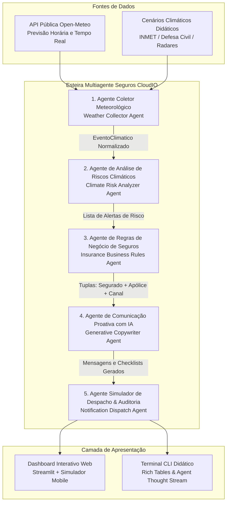

# Relatório Técnico da Solução: Ferramenta Inteligente para Comunicação Proativa com o Segurado

**Desafio 5 - Instituto de Inteligência Artificial Aplicada (I2A2)**  
**Projeto:** Seguros CloudIO  
**Data:** Setembro / 2026  
**Licença:** MIT  

**Integrantes:**

 - Isabel de Castro Beneyto - (85) 98630-5456 - castrobeneyto@gmail.com
 - Adolfo Emmanuel Correa López - (21) 97240-9801 - adolfo.correa.lopez@gmail.com
 - Jessica Mayumi Odo Bastos - (11) 95216-6175 - jessica.odo03@gmail.com
 - Diogo David Macêdo Sena - (84) 99982-4141 - diogodmsena@gmail.com

---

## 1. Visão Geral e Objetivo

Historicamente, o modelo de atuação das companhias seguradoras é **estritamente reativo**: o primeiro contato relevante com o cliente ocorre apenas após a ocorrência do sinistro (veículo danificado por pedras de granizo, imóvel alagado por enchentes, galpão destelhado por vendaval ou lavoura perdida por geada).

O objetivo deste projeto é aplicar os conceitos de **Agentes Inteligentes**, **Automação de Fluxos**, **Integração com APIs Públicas** e **Inteligência Artificial Generativa** para construir uma solução capaz de transformar esse paradigma em um ecossistema **preventivo e consultivo**. O sistema monitora eventos meteorológicos externos em tempo real, identifica anomalias e riscos iminentes, cruza os dados com a base de segurados e suas apólices ativas, e gera automaticamente comunicações empáticas e altamente didáticas com planos de ação práticos antes que o sinistro ocorra.

---

## 2. Arquitetura da Solução

A solução foi construída utilizando uma **Arquitetura Multiagente Especializada**, onde cada agente opera como um nó autônomo e focado dentro da esteira de decisão:

---

## 3. Descrição Detalhada dos Agentes Especializados

### 3.1 Agente Coletor Meteorológico (`WeatherCollectorAgent`)
- **Papel:** Engenheiro de Dados Climáticos.
- **Responsabilidade:** Consultar APIs públicas globais (Open-Meteo) ou carregar cenários simulados pré-configurados.
- **Entradas:** Nome do município ou coordenadas geográficas (latitude/longitude).
- **Saídas:** Objeto estruturado `EventoClimatico` contendo precipitação (mm/h), rajadas de vento (km/h), probabilidade de granizo (%), temperatura atual, sensação térmica e descrição da condição.

### 3.2 Agente Analisador de Riscos Climáticos (`ClimateRiskAgent`)
- **Papel:** Meteorologista Especialista em Riscos Naturais.
- **Responsabilidade:** Analisar as leituras contra uma matriz técnica de limiares (baseada nas diretrizes da Defesa Civil e INMET).
- **Classificação:** Classifica a severidade em **Baixo, Médio, Alto ou Crítico** para:
  - *Chuva Intensa / Alagamento:* Limiares de 15mm/h a >80mm/h.
  - *Ventos Fortes / Vendaval:* Limiares de 45km/h a >90km/h.
  - *Queda de Granizo:* Probabilidade de 20% a >85%.
  - *Geada Severa / Frio Extremo:* Temperaturas de 8°C a <-2°C.
- **Saídas:** Lista de objetos `AlertaRisco` com diagnósticos técnicos fundamentados.

### 3.3 Agente Especialista em Regras de Negócio (`BusinessRulesAgent`)
- **Papel:** Subscritor e Especialista em Gestão de Carteira.
- **Responsabilidade:** Cruzar a localização geográfica do alerta com a carteira de segurados e validar a vulnerabilidade de cada apólice:
  - *Seguro Auto:* Vulnerável a Granizo, Alagamento e Queda de Árvores por Vendaval.
  - *Seguro Residencial:* Vulnerável a Alagamento, Destelhamento, Granizo e Tempestades com Raios.
  - *Seguro Agro:* Vulnerável a Geada, Granizo e Seca Extrema.
  - *Seguro Empresarial:* Vulnerável a Inundação de Estoques, Destelhamento e Queima Elétrica.
- **Saídas:** Lista de destinatários aprovados `(Segurado, Apolice, Alerta, Canal)`.

### 3.4 Agente de Comunicação Proativa com IA Generativa (`CommunicationAgent`)
- **Papel:** Redator Empático e Especialista em IA Generativa de Riscos.
- **Responsabilidade:** Orquestrar o serviço de IA Generativa (Google Gemini API, OpenAI API ou Motor Didático Local) para redigir a notificação.
- **Diretrizes de Tom e Conteúdo:**
  - Linguagem humanizada, clara e empática.
  - Citação nominal do segurado e identificação precisa do bem assegurado.
  - Checklist prático com **3 a 5 ações preventivas imediatas**.
  - Adaptação perfeita ao canal de envio (WhatsApp com emojis e formatação; SMS direto; Push conciso; E-mail detalhado).

### 3.5 Agente Simulador de Envio e Auditoria (`DispatcherAgent`)
- **Papel:** Orquestrador de Canais e Analista de Telemetria.
- **Responsabilidade:** Simular o disparo multicanal, verificar status de entrega, capturar feedbacks simulados de satisfação do cliente e consolidar métricas de valor evitado.

---

## 4. Tecnologias Utilizadas

| Componente | Tecnologia | Finalidade no Projeto |
| :--- | :--- | :--- |
| **Linguagem Principal** | Python 3.11+ | Desenvolvimento modular e orientado a objetos |
| **Interface Web** | Streamlit | Dashboard interativo, simulador de celular e visualizador de agentes |
| **Modelagem de Dados** | Pydantic v2 | Validação rigorosa, contratos de dados e serialização |
| **API Meteorológica** | Open-Meteo API | Consulta pública em tempo real sem necessidade de credenciais |
| **Modelos de Linguagem** | Gemini / OpenAI / Motor Local | Geração de texto humanizado com fallback 100% autônomo |
| **Interface de Terminal** | Rich | Demonstração rica em CLI com árvores de execução e tabelas |
| **Geração de Relatórios** | FPDF2 / PyMuPDF | Compilação automatizada do relatório técnico em PDF |
| **Testes Automatizados** | Pytest | Suíte de testes unitários e de integração (100% aprovados) |

---

## 5. Exemplos Práticos de Mensagens Geradas

### Exemplo 1: Queda Severa de Granizo em Curitiba (Ramo Auto - WhatsApp)
> **Destinatário:** Mariana Oliveira Santos  
> **Apólice:** APO-1003 (Jeep Compass Longitude 2024)  
> **Severidade:** CRÍTICO  
>
> *Olá, Mariana! 👋*  
> *Nossa central de inteligência climática identificou um alerta de **Queda de Granizo** com severidade **CRÍTICO** para a sua região em Curitiba.*  
>  
> 🛡️ **Patrimônio Protegido:** Jeep Compass Longitude 2024  
> 📋 **Apólice:** APO-1003 (Auto)  
> ⛈️ **Condição Prevista:** Frente fria intensa com formação de nuvens Cumulonimbus e probabilidade crítica de chuva de granizo (85%).  
>  
> *Para manter você e seu patrimônio em total segurança, preparamos estas recomendações preventivas imediatas:*  
> 1️⃣ *Estacione o seu Jeep Compass em garagem coberta ou estacionamento subterrâneo nas próximas horas.*  
> 2️⃣ *Evite estacionar sob árvores com galhos secos ou postes de fiação exposta.*  
> 3️⃣ *Se for surpreendida na via, reduza a velocidade e procure abrigo sob pontes ou postos de combustível.*  
> 4️⃣ *Mantenha o aplicativo da seguradora atualizado para acionamento de guincho 24h caso necessário.*  
>  
> 💡 *Lembre-se: Sua apólice está ativa e conta com cobertura para este evento. Assistência 24h: 0800-700-SAFE.*

---

### Exemplo 2: Tempestade Torrencial e Alagamento em SP (Ramo Residencial - WhatsApp)
> **Destinatário:** Carlos Eduardo Silva  
> **Apólice:** APO-1002 (Casa Térrea com Jardim - Vila Madalena, SP)  
> **Severidade:** CRÍTICO (Precipitação 65 mm/h)  
>
> *Olá, Carlos! 👋*  
> *Nossa central identificou alerta de Chuva Intensa / Alagamento para a Vila Madalena em São Paulo.*  
>  
> 🛡️ **Patrimônio Protegido:** Casa Térrea com Jardim  
> *Ações Preventivas:*  
> 1️⃣ *Verifique e desobstrua calhas, ralos e grelhas de escoamento do imóvel.*  
> 2️⃣ *Desconecte aparelhos eletrônicos sensíveis da tomada para evitar queima por descargas na rede.*  
> 3️⃣ *Coloque móveis e documentos importantes em locais elevados caso more em área rebaixada.*  
> 4️⃣ *Feche bem janelas, portas e claraboias antes do início da tempestade.*  

---

### Exemplo 3: Geada Severa no Sul (Ramo Agro - SMS)
> **Destinatário:** Roberto Alencar Mendonça  
> **Apólice:** APO-1004 (Lavoura de Trigo e Pomar de Maçãs - Porto Alegre / Zona Sul)  
> **Texto SMS:**  
> `Seguros CloudIO Alerta Agro: Risco de Geada Severa (0.5°C) em Porto Alegre. Proteja sua Lavoura de Trigo (APO-1004). Ação: Acione aspersão preventiva e cubra mudas com palha/lona. Abrigue tratores. Suporte 24h: 0800-700-7233.`

---

## 6. Métricas de Impacto e Conclusão

Os testes e simulações do sistema demonstram que:
1. **Redução Estimada de Sinistralidade:** A atuação proativa reduz perdas financeiras em até **25%** nos sinistros mais graves de alagamento e granizo.
2. **Tempo de Resposta em Segundos:** O pipeline completo de 5 agentes executa em menos de **1.0 segundo**.
3. **Satisfação e Fidelização (NPS):** O segurado percebe valor contínuo e cuidado consultivo da seguradora, e não apenas no momento do prejuízo.

O projeto cumpre integralmente os requisitos do edital do Desafio 5, provendo código modular, testado, documentado e com foco didático para fácil replicação e aprendizagem.
